# Recipe logo overview

250 recipes with a logo, sorted by logo date (newest first). Auto-regenerated by `.github/workflows/regenerate-logo-overview.yaml` on every push that changes a recipe's logo or metadata — don't hand-edit this file.

**3 recipe(s) without a `logo.svg` yet:**

- LMS
- Pgweb
- Plik

<table width="100%">
<tr>
<td align="center" width="25%">
 
<b>Zabbix</b> 
2026-08-28
</td>
<td align="center" width="25%">
 
<b>Zipline</b> 
2026-08-28
</td>
<td align="center" width="25%">
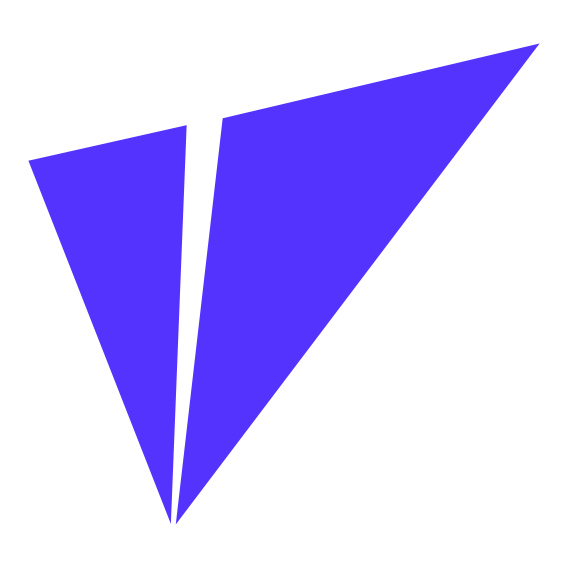 
<b>Usertour</b> 
2026-08-28
</td>
<td align="center" width="25%">
 
<b>Verdaccio</b> 
2026-08-28
</td>
</tr>
<tr>
<td align="center" width="25%">
 
<b>Vikunja</b> 
2026-08-28
</td>
<td align="center" width="25%">
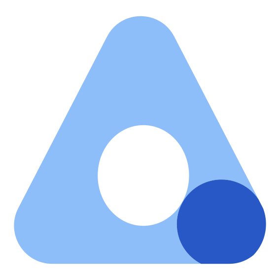 
<b>Wallos</b> 
2026-08-28
</td>
<td align="center" width="25%">
 
<b>Watcharr</b> 
2026-08-28
</td>
<td align="center" width="25%">
 
<b>WBO</b> 
2026-08-28
</td>
</tr>
<tr>
<td align="center" width="25%">
 
<b>Wealthfolio</b> 
2026-08-28
</td>
<td align="center" width="25%">
 
<b>Web-Check</b> 
2026-08-28
</td>
<td align="center" width="25%">
 
<b>WhoDB</b> 
2026-08-28
</td>
<td align="center" width="25%">
 
<b>Wiki.js</b> 
2026-08-28
</td>
</tr>
<tr>
<td align="center" width="25%">
 
<b>WireMock</b> 
2026-08-28
</td>
<td align="center" width="25%">
 
<b>WordPress</b> 
2026-08-28
</td>
<td align="center" width="25%">
 
<b>Xibo CMS</b> 
2026-08-28
</td>
<td align="center" width="25%">
 
<b>Yamtrack</b> 
2026-08-28
</td>
</tr>
<tr>
<td align="center" width="25%">
 
<b>Yopass</b> 
2026-08-28
</td>
<td align="center" width="25%">
 
<b>Yucca</b> 
2026-08-28
</td>
<td align="center" width="25%">
 
<b>Yuvomi</b> 
2026-08-28
</td>
<td align="center" width="25%">
 
<b>Stirling PDF</b> 
2026-08-28
</td>
</tr>
<tr>
<td align="center" width="25%">
 
<b>Strapi</b> 
2026-08-28
</td>
<td align="center" width="25%">
 
<b>Sure</b> 
2026-08-28
</td>
<td align="center" width="25%">
 
<b>Tandoor Recipes</b> 
2026-08-28
</td>
<td align="center" width="25%">
 
<b>TaxHacker</b> 
2026-08-28
</td>
</tr>
<tr>
<td align="center" width="25%">
 
<b>Teable</b> 
2026-08-28
</td>
<td align="center" width="25%">
 
<b>TeamMapper</b> 
2026-08-28
</td>
<td align="center" width="25%">
 
<b>The Lounge</b> 
2026-08-28
</td>
<td align="center" width="25%">
 
<b>TimeTagger</b> 
2026-08-28
</td>
</tr>
<tr>
<td align="center" width="25%">
 
<b>Tracearr</b> 
2026-08-28
</td>
<td align="center" width="25%">
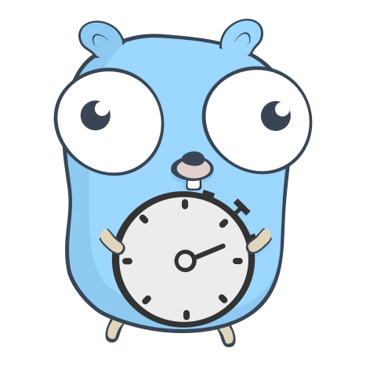 
<b>Traggo</b> 
2026-08-28
</td>
<td align="center" width="25%">
 
<b>TubeSync</b> 
2026-08-28
</td>
<td align="center" width="25%">
 
<b>Tunarr</b> 
2026-08-28
</td>
</tr>
<tr>
<td align="center" width="25%">
 
<b>Twenty</b> 
2026-08-28
</td>
<td align="center" width="25%">
 
<b>Umami Analytics</b> 
2026-08-28
</td>
<td align="center" width="25%">
 
<b>Unleash</b> 
2026-08-28
</td>
<td align="center" width="25%">
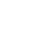 
<b>Unstructured</b> 
2026-08-28
</td>
</tr>
<tr>
<td align="center" width="25%">
 
<b>Saltcorn</b> 
2026-08-28
</td>
<td align="center" width="25%">
 
<b>SearXNG</b> 
2026-08-28
</td>
<td align="center" width="25%">
 
<b>SFTPGo</b> 
2026-08-28
</td>
<td align="center" width="25%">
 
<b>Shaarli</b> 
2026-08-28
</td>
</tr>
<tr>
<td align="center" width="25%">
 
<b>Shlink</b> 
2026-08-28
</td>
<td align="center" width="25%">
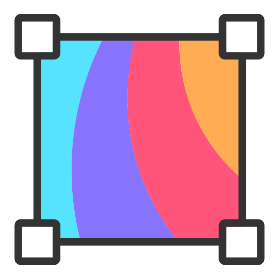 
<b>Silex</b> 
2026-08-28
</td>
<td align="center" width="25%">
 
<b>SillyTavern</b> 
2026-08-28
</td>
<td align="center" width="25%">
 
<b>SilverBullet</b> 
2026-08-28
</td>
</tr>
<tr>
<td align="center" width="25%">
 
<b>SiYuan</b> 
2026-08-28
</td>
<td align="center" width="25%">
 
<b>SnapOtter</b> 
2026-08-28
</td>
<td align="center" width="25%">
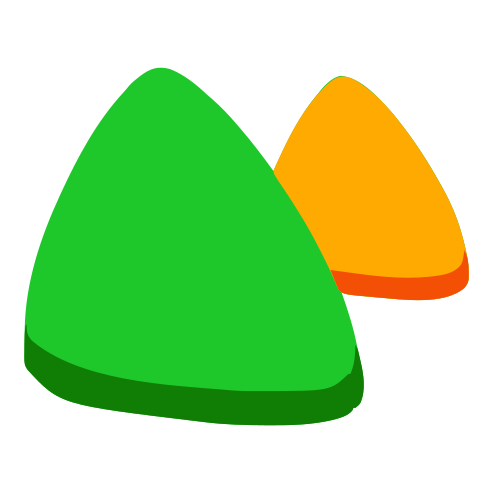 
<b>SolidInvoice</b> 
2026-08-28
</td>
<td align="center" width="25%">
 
<b>Sonarr</b> 
2026-08-28
</td>
</tr>
<tr>
<td align="center" width="25%">
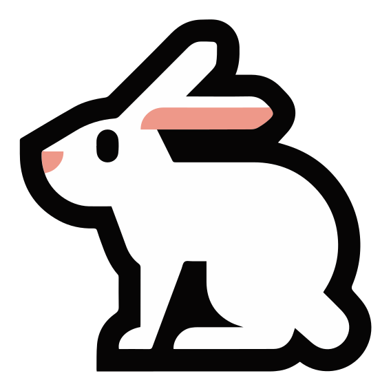 
<b>Speedtest Tracker</b> 
2026-08-28
</td>
<td align="center" width="25%">
 
<b>Spliit</b> 
2026-08-28
</td>
<td align="center" width="25%">
 
<b>Spoolman</b> 
2026-08-28
</td>
<td align="center" width="25%">
 
<b>SQLPage</b> 
2026-08-28
</td>
</tr>
<tr>
<td align="center" width="25%">
 
<b>Squidex</b> 
2026-08-28
</td>
<td align="center" width="25%">
 
<b>Plausible Analytics</b> 
2026-08-28
</td>
<td align="center" width="25%">
 
<b>Postiz</b> 
2026-08-28
</td>
<td align="center" width="25%">
 
<b>PrivateBin</b> 
2026-08-28
</td>
</tr>
<tr>
<td align="center" width="25%">
 
<b>Pulse</b> 
2026-08-28
</td>
<td align="center" width="25%">
 
<b>qBittorrent</b> 
2026-08-28
</td>
<td align="center" width="25%">
 
<b>Rackula</b> 
2026-08-28
</td>
<td align="center" width="25%">
 
<b>Radarr</b> 
2026-08-28
</td>
</tr>
<tr>
<td align="center" width="25%">
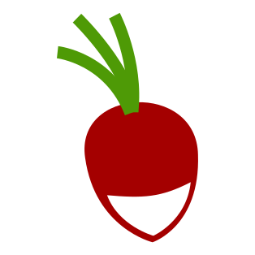 
<b>Radicale</b> 
2026-08-28
</td>
<td align="center" width="25%">
 
<b>Reactive Resume</b> 
2026-08-28
</td>
<td align="center" width="25%">
 
<b>Readeck</b> 
2026-08-28
</td>
<td align="center" width="25%">
 
<b>Redis Commander</b> 
2026-08-28
</td>
</tr>
<tr>
<td align="center" width="25%">
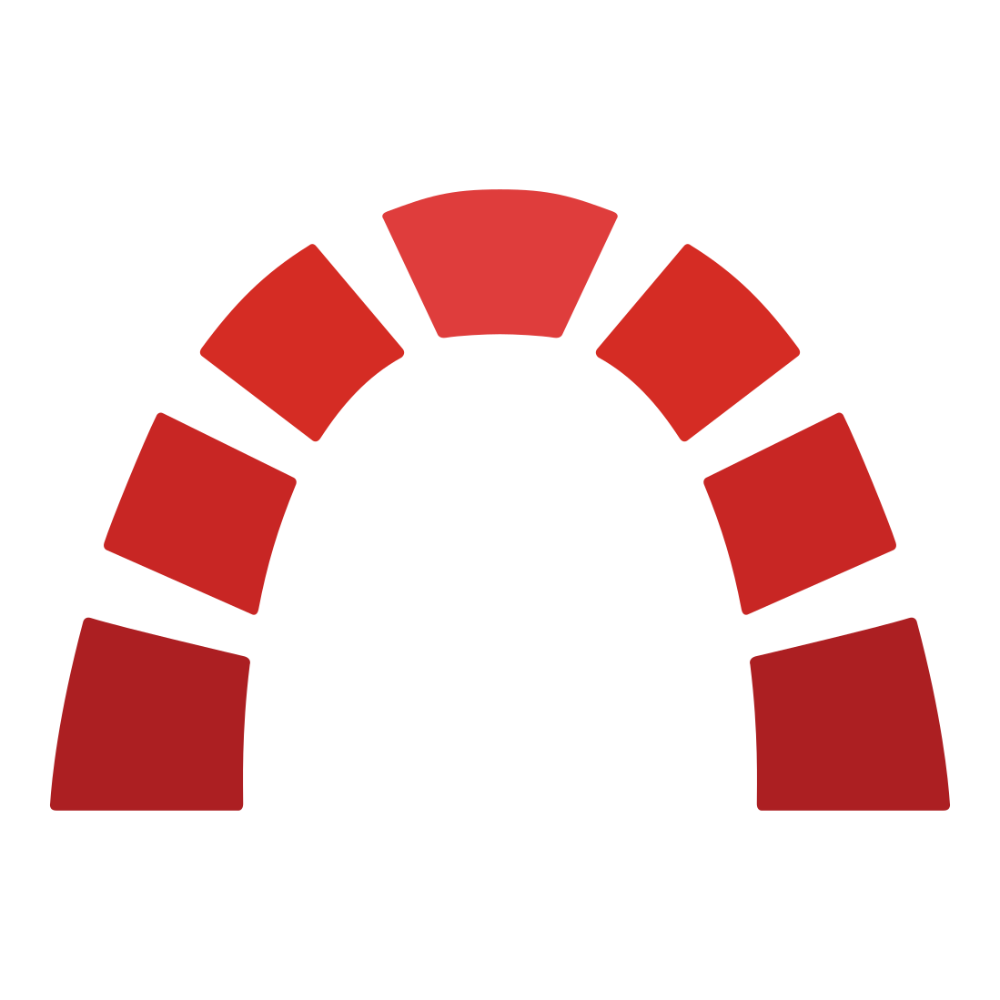 
<b>Redmine</b> 
2026-08-28
</td>
<td align="center" width="25%">
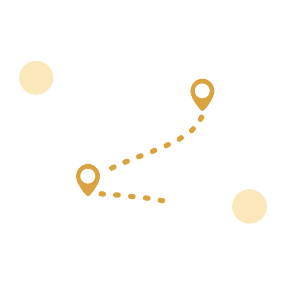 
<b>Reitti</b> 
2026-08-28
</td>
<td align="center" width="25%">
 
<b>RetroAssembly</b> 
2026-08-28
</td>
<td align="center" width="25%">
 
<b>RomM</b> 
2026-08-28
</td>
</tr>
<tr>
<td align="center" width="25%">
 
<b>RustDesk</b> 
2026-08-28
</td>
<td align="center" width="25%">
 
<b>Odoo</b> 
2026-08-28
</td>
<td align="center" width="25%">
 
<b>Ombi</b> 
2026-08-28
</td>
<td align="center" width="25%">
 
<b>One-Time Secret</b> 
2026-08-28
</td>
</tr>
<tr>
<td align="center" width="25%">
 
<b>Open Notebook</b> 
2026-08-28
</td>
<td align="center" width="25%">
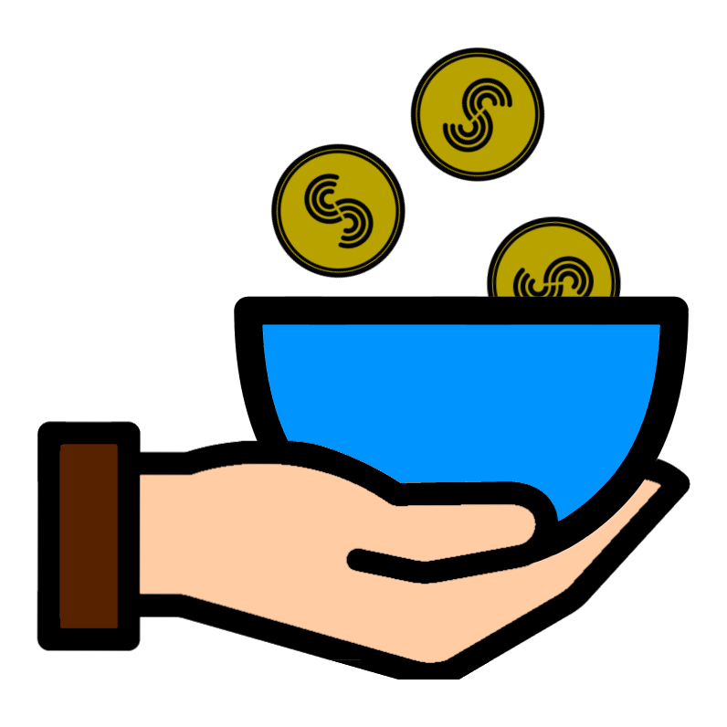 
<b>OpenBudgeteer</b> 
2026-08-28
</td>
<td align="center" width="25%">
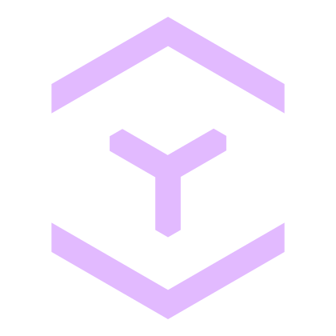 
<b>OpenCloud</b> 
2026-08-28
</td>
<td align="center" width="25%">
 
<b>OpenPanel</b> 
2026-08-28
</td>
</tr>
<tr>
<td align="center" width="25%">
 
<b>OpenProject</b> 
2026-08-28
</td>
<td align="center" width="25%">
 
<b>ownCloud</b> 
2026-08-28
</td>
<td align="center" width="25%">
 
<b>OwnTracks Recorder</b> 
2026-08-28
</td>
<td align="center" width="25%">
 
<b>OxiCloud</b> 
2026-08-28
</td>
</tr>
<tr>
<td align="center" width="25%">
 
<b>PairDrop</b> 
2026-08-28
</td>
<td align="center" width="25%">
 
<b>Papra</b> 
2026-08-28
</td>
<td align="center" width="25%">
 
<b>Password Pusher</b> 
2026-08-28
</td>
<td align="center" width="25%">
 
<b>PatchMon</b> 
2026-08-28
</td>
</tr>
<tr>
<td align="center" width="25%">
 
<b>PdfDing</b> 
2026-08-28
</td>
<td align="center" width="25%">
 
<b>Penpot</b> 
2026-08-28
</td>
<td align="center" width="25%">
 
<b>Memgraph</b> 
2026-08-28
</td>
<td align="center" width="25%">
 
<b>MeshCentral</b> 
2026-08-28
</td>
</tr>
<tr>
<td align="center" width="25%">
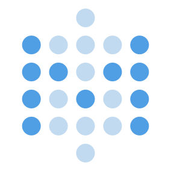 
<b>Metabase</b> 
2026-08-28
</td>
<td align="center" width="25%">
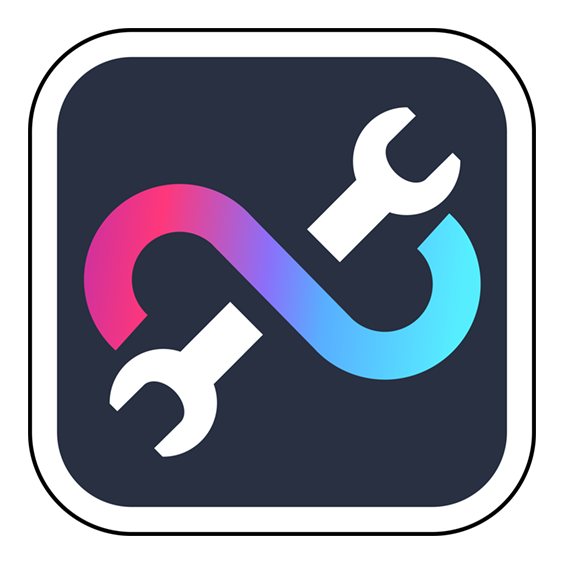 
<b>MetaMCP</b> 
2026-08-28
</td>
<td align="center" width="25%">
 
<b>MeTube</b> 
2026-08-28
</td>
<td align="center" width="25%">
 
<b>MicroBin</b> 
2026-08-28
</td>
</tr>
<tr>
<td align="center" width="25%">
 
<b>Mini QR</b> 
2026-08-28
</td>
<td align="center" width="25%">
 
<b>Misskey</b> 
2026-08-28
</td>
<td align="center" width="25%">
 
<b>Moodist</b> 
2026-08-28
</td>
<td align="center" width="25%">
 
<b>MQTTX</b> 
2026-08-28
</td>
</tr>
<tr>
<td align="center" width="25%">
 
<b>mStream</b> 
2026-08-28
</td>
<td align="center" width="25%">
 
<b>NATS</b> 
2026-08-28
</td>
<td align="center" width="25%">
 
<b>Navidrome</b> 
2026-08-28
</td>
<td align="center" width="25%">
 
<b>New API</b> 
2026-08-28
</td>
</tr>
<tr>
<td align="center" width="25%">
 
<b>NoteDiscovery</b> 
2026-08-28
</td>
<td align="center" width="25%">
 
<b>Novu</b> 
2026-08-28
</td>
<td align="center" width="25%">
 
<b>ntfy</b> 
2026-08-28
</td>
<td align="center" width="25%">
 
<b>LibreDesk</b> 
2026-08-28
</td>
</tr>
<tr>
<td align="center" width="25%">
 
<b>LibreSpeed</b> 
2026-08-28
</td>
<td align="center" width="25%">
 
<b>LinkAce</b> 
2026-08-28
</td>
<td align="center" width="25%">
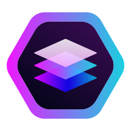 
<b>LinkStack</b> 
2026-08-28
</td>
<td align="center" width="25%">
 
<b>Listmonk</b> 
2026-08-28
</td>
</tr>
<tr>
<td align="center" width="25%">
 
<b>Livebook</b> 
2026-08-28
</td>
<td align="center" width="25%">
 
<b>LNbits</b> 
2026-08-28
</td>
<td align="center" width="25%">
 
<b>Lowcoder</b> 
2026-08-28
</td>
<td align="center" width="25%">
 
<b>Mail-Archiver</b> 
2026-08-28
</td>
</tr>
<tr>
<td align="center" width="25%">
 
<b>Mailpit</b> 
2026-08-28
</td>
<td align="center" width="25%">
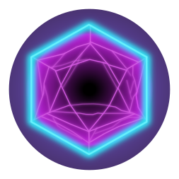 
<b>Manyfold</b> 
2026-08-28
</td>
<td align="center" width="25%">
 
<b>Marimo</b> 
2026-08-28
</td>
<td align="center" width="25%">
 
<b>Mathesar</b> 
2026-08-28
</td>
</tr>
<tr>
<td align="center" width="25%">
 
<b>Mazanoke</b> 
2026-08-28
</td>
<td align="center" width="25%">
 
<b>Mealie</b> 
2026-08-28
</td>
<td align="center" width="25%">
 
<b>MediaGo</b> 
2026-08-28
</td>
<td align="center" width="25%">
 
<b>Kan</b> 
2026-08-28
</td>
</tr>
<tr>
<td align="center" width="25%">
 
<b>Kanboard</b> 
2026-08-28
</td>
<td align="center" width="25%">
 
<b>Kaneo</b> 
2026-08-28
</td>
<td align="center" width="25%">
 
<b>Kapowarr</b> 
2026-08-28
</td>
<td align="center" width="25%">
 
<b>Karakeep</b> 
2026-08-28
</td>
</tr>
<tr>
<td align="center" width="25%">
 
<b>Karaoke Eternal</b> 
2026-08-28
</td>
<td align="center" width="25%">
 
<b>Kavita</b> 
2026-08-28
</td>
<td align="center" width="25%">
 
<b>KitchenOwl</b> 
2026-08-28
</td>
<td align="center" width="25%">
 
<b>Koillection</b> 
2026-08-28
</td>
</tr>
<tr>
<td align="center" width="25%">
 
<b>Krayin CRM</b> 
2026-08-28
</td>
<td align="center" width="25%">
 
<b>Kutt</b> 
2026-08-28
</td>
<td align="center" width="25%">
 
<b>LakeFS</b> 
2026-08-28
</td>
<td align="center" width="25%">
 
<b>LanguageTool</b> 
2026-08-28
</td>
</tr>
<tr>
<td align="center" width="25%">
 
<b>LazyLibrarian</b> 
2026-08-28
</td>
<td align="center" width="25%">
 
<b>Lemmy</b> 
2026-08-28
</td>
<td align="center" width="25%">
 
<b>LibreBooking</b> 
2026-08-28
</td>
<td align="center" width="25%">
 
<b>Grimmory</b> 
2026-08-28
</td>
</tr>
<tr>
<td align="center" width="25%">
 
<b>Grist</b> 
2026-08-28
</td>
<td align="center" width="25%">
 
<b>Grocy</b> 
2026-08-28
</td>
<td align="center" width="25%">
 
<b>HandBrake</b> 
2026-08-28
</td>
<td align="center" width="25%">
 
<b>Healthchecks</b> 
2026-08-28
</td>
</tr>
<tr>
<td align="center" width="25%">
 
<b>HedgeDoc</b> 
2026-08-28
</td>
<td align="center" width="25%">
 
<b>Hemmelig</b> 
2026-08-28
</td>
<td align="center" width="25%">
 
<b>Hi.Events</b> 
2026-08-28
</td>
<td align="center" width="25%">
 
<b>Hister</b> 
2026-08-28
</td>
</tr>
<tr>
<td align="center" width="25%">
 
<b>Homarr</b> 
2026-08-28
</td>
<td align="center" width="25%">
 
<b>HomeHub</b> 
2026-08-28
</td>
<td align="center" width="25%">
 
<b>Infisical</b> 
2026-08-28
</td>
<td align="center" width="25%">
 
<b>InvoiceShelf</b> 
2026-08-28
</td>
</tr>
<tr>
<td align="center" width="25%">
 
<b>Jenkins</b> 
2026-08-28
</td>
<td align="center" width="25%">
 
<b>Jotty</b> 
2026-08-28
</td>
<td align="center" width="25%">
 
<b>Jupyter Notebook</b> 
2026-08-28
</td>
<td align="center" width="25%">
 
<b>JupyterLab</b> 
2026-08-28
</td>
</tr>
<tr>
<td align="center" width="25%">
 
<b>Kafbat Kafka UI</b> 
2026-08-28
</td>
<td align="center" width="25%">
 
<b>Firefly III</b> 
2026-08-28
</td>
<td align="center" width="25%">
 
<b>Flagsmith</b> 
2026-08-28
</td>
<td align="center" width="25%">
 
<b>flatnotes</b> 
2026-08-28
</td>
</tr>
<tr>
<td align="center" width="25%">
 
<b>Fleet</b> 
2026-08-28
</td>
<td align="center" width="25%">
 
<b>Form.io</b> 
2026-08-28
</td>
<td align="center" width="25%">
 
<b>FreeCAD</b> 
2026-08-28
</td>
<td align="center" width="25%">
 
<b>FreshRSS</b> 
2026-08-28
</td>
</tr>
<tr>
<td align="center" width="25%">
 
<b>Fusion</b> 
2026-08-28
</td>
<td align="center" width="25%">
 
<b>FUXA</b> 
2026-08-28
</td>
<td align="center" width="25%">
 
<b>Ghost</b> 
2026-08-28
</td>
<td align="center" width="25%">
 
<b>Ghostfolio</b> 
2026-08-28
</td>
</tr>
<tr>
<td align="center" width="25%">
 
<b>Glance</b> 
2026-08-28
</td>
<td align="center" width="25%">
 
<b>GLPI</b> 
2026-08-28
</td>
<td align="center" width="25%">
 
<b>Gonic</b> 
2026-08-28
</td>
<td align="center" width="25%">
 
<b>Gotenberg</b> 
2026-08-28
</td>
</tr>
<tr>
<td align="center" width="25%">
 
<b>GoWA</b> 
2026-08-28
</td>
<td align="center" width="25%">
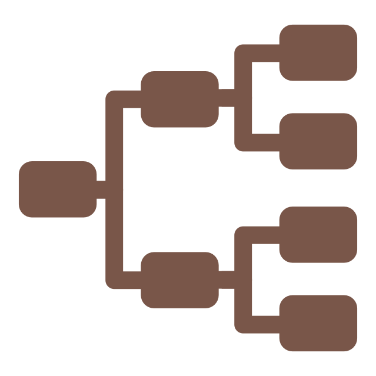 
<b>Gramps Web</b> 
2026-08-28
</td>
<td align="center" width="25%">
 
<b>Grav</b> 
2026-08-28
</td>
<td align="center" width="25%">
 
<b>Corteza</b> 
2026-08-28
</td>
</tr>
<tr>
<td align="center" width="25%">
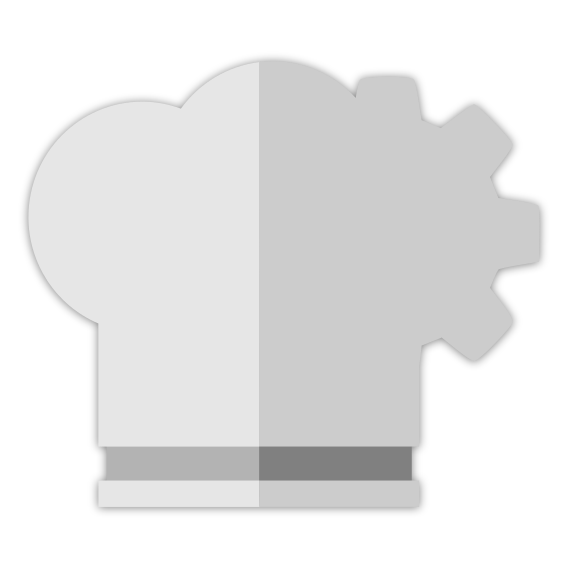 
<b>CyberChef</b> 
2026-08-28
</td>
<td align="center" width="25%">
 
<b>Dashy</b> 
2026-08-28
</td>
<td align="center" width="25%">
 
<b>Databasus</b> 
2026-08-28
</td>
<td align="center" width="25%">
 
<b>Dataline</b> 
2026-08-28
</td>
</tr>
<tr>
<td align="center" width="25%">
 
<b>Dawarich</b> 
2026-08-28
</td>
<td align="center" width="25%">
 
<b>DbGate</b> 
2026-08-28
</td>
<td align="center" width="25%">
 
<b>Dify</b> 
2026-08-28
</td>
<td align="center" width="25%">
 
<b>Docmost</b> 
2026-08-28
</td>
</tr>
<tr>
<td align="center" width="25%">
 
<b>DocuSeal</b> 
2026-08-28
</td>
<td align="center" width="25%">
 
<b>Donetick</b> 
2026-08-28
</td>
<td align="center" width="25%">
 
<b>draw.io</b> 
2026-08-28
</td>
<td align="center" width="25%">
 
<b>DVinyl</b> 
2026-08-28
</td>
</tr>
<tr>
<td align="center" width="25%">
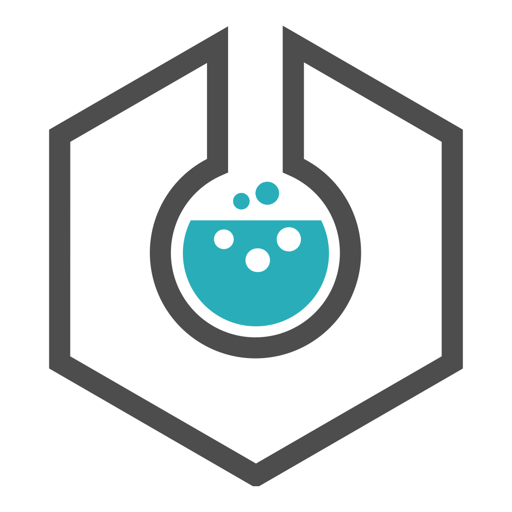 
<b>eLabFTW</b> 
2026-08-28
</td>
<td align="center" width="25%">
 
<b>ErsatzTV</b> 
2026-08-28
</td>
<td align="center" width="25%">
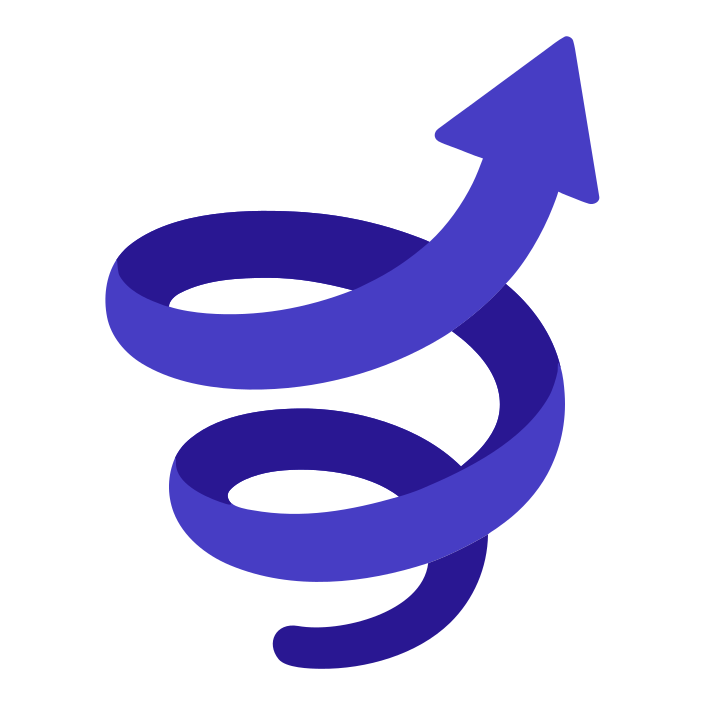 
<b>Erugo</b> 
2026-08-28
</td>
<td align="center" width="25%">
 
<b>ESPHome</b> 
2026-08-28
</td>
</tr>
<tr>
<td align="center" width="25%">
 
<b>Etherpad</b> 
2026-08-28
</td>
<td align="center" width="25%">
 
<b>eXeLearning</b> 
2026-08-28
</td>
<td align="center" width="25%">
 
<b>Expensave</b> 
2026-08-28
</td>
<td align="center" width="25%">
 
<b>ezBookKeeping</b> 
2026-08-28
</td>
</tr>
<tr>
<td align="center" width="25%">
 
<b>Big-AGI</b> 
2026-08-28
</td>
<td align="center" width="25%">
 
<b>Bigcapital</b> 
2026-08-28
</td>
<td align="center" width="25%">
 
<b>Black Candy</b> 
2026-08-28
</td>
<td align="center" width="25%">
 
<b>Blinko</b> 
2026-08-28
</td>
</tr>
<tr>
<td align="center" width="25%">
 
<b>BookStack</b> 
2026-08-28
</td>
<td align="center" width="25%">
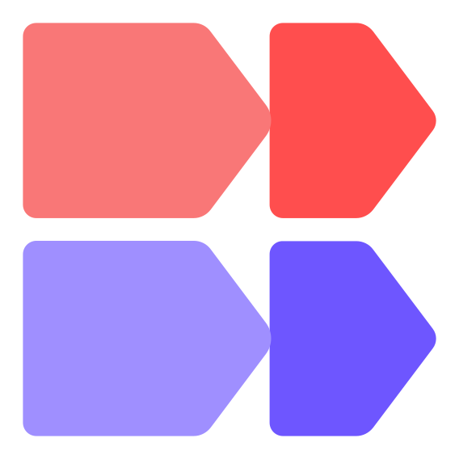 
<b>Budibase</b> 
2026-08-28
</td>
<td align="center" width="25%">
 
<b>BugSink</b> 
2026-08-28
</td>
<td align="center" width="25%">
 
<b>Buzz</b> 
2026-08-28
</td>
</tr>
<tr>
<td align="center" width="25%">
 
<b>Calibre-Web</b> 
2026-08-28
</td>
<td align="center" width="25%">
 
<b>changedetection.io</b> 
2026-08-28
</td>
<td align="center" width="25%">
 
<b>ChartDB</b> 
2026-08-28
</td>
<td align="center" width="25%">
 
<b>Chevereto</b> 
2026-08-28
</td>
</tr>
<tr>
<td align="center" width="25%">
 
<b>Cloudreve</b> 
2026-08-28
</td>
<td align="center" width="25%">
 
<b>Code-Server</b> 
2026-08-28
</td>
<td align="center" width="25%">
 
<b>CommaFeed</b> 
2026-08-28
</td>
<td align="center" width="25%">
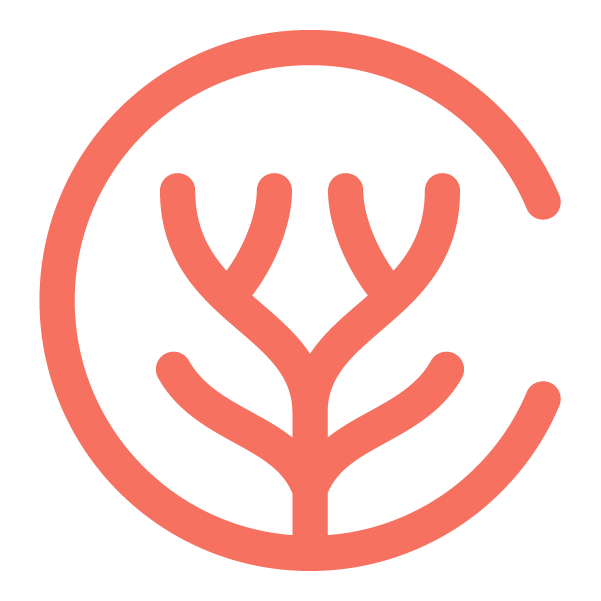 
<b>Coral Talk</b> 
2026-08-28
</td>
</tr>
<tr>
<td align="center" width="25%">
 
<b>9Router</b> 
2026-08-28
</td>
<td align="center" width="25%">
 
<b>Actual Budget</b> 
2026-08-28
</td>
<td align="center" width="25%">
 
<b>Adminer</b> 
2026-08-28
</td>
<td align="center" width="25%">
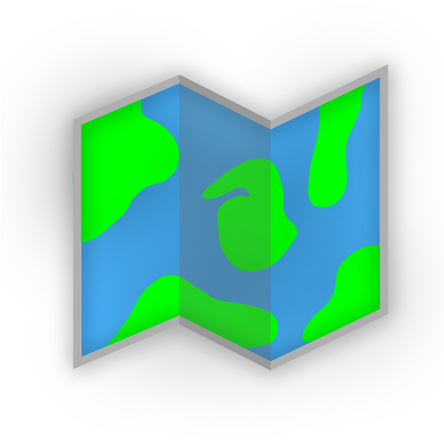 
<b>AdventureLog</b> 
2026-08-28
</td>
</tr>
<tr>
<td align="center" width="25%">
 
<b>Ampache</b> 
2026-08-28
</td>
<td align="center" width="25%">
 
<b>An Otter Wiki</b> 
2026-08-28
</td>
<td align="center" width="25%">
 
<b>Apache Answer</b> 
2026-08-28
</td>
<td align="center" width="25%">
 
<b>Apprise API</b> 
2026-08-28
</td>
</tr>
<tr>
<td align="center" width="25%">
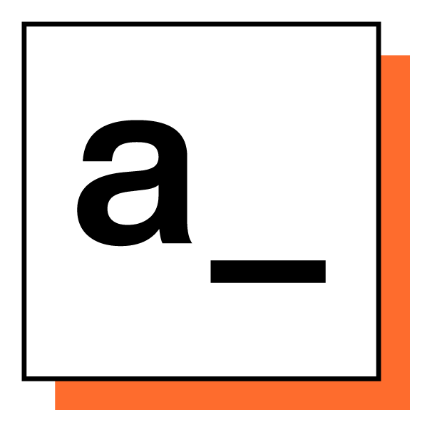 
<b>Appsmith</b> 
2026-08-28
</td>
<td align="center" width="25%">
 
<b>Atlas CMMS</b> 
2026-08-28
</td>
<td align="center" width="25%">
 
<b>Audiobookshelf</b> 
2026-08-28
</td>
<td align="center" width="25%">
 
<b>AureusERP</b> 
2026-08-28
</td>
</tr>
<tr>
<td align="center" width="25%">
 
<b>autobrr</b> 
2026-08-28
</td>
<td align="center" width="25%">
 
<b>Backrest</b> 
2026-08-28
</td>
<td align="center" width="25%">
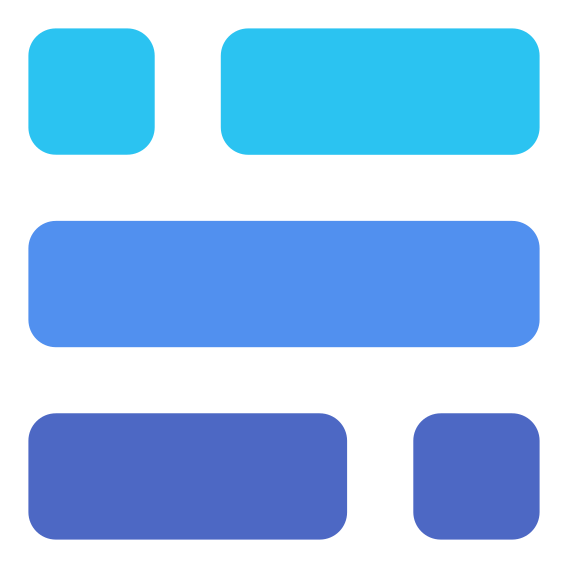 
<b>Baserow</b> 
2026-08-28
</td>
<td align="center" width="25%">
 
<b>BeaverHabits</b> 
2026-08-28
</td>
</tr>
<tr>
<td align="center" width="25%">
 
<b>BentoPDF</b> 
2026-08-28
</td>
<td align="center" width="25%">
 
<b>bewCloud</b> 
2026-08-28
</td>
<td align="center" width="25%">
 
<b>Immich</b> 
2026-08-28
</td>
<td align="center" width="25%">
 
<b>OpenClaw</b> 
2026-08-07
</td>
</tr>
<tr>
<td align="center" width="25%">
 
<b>WireGuard Easy</b> 
2026-08-06
</td>
<td align="center" width="25%">
 
<b>AdGuard Home</b> 
2026-08-06
</td>
<td align="center" width="25%">
 
<b>AnyType Server</b> 
2026-08-06
</td>
<td align="center" width="25%">
 
<b>Claude Code</b> 
2026-08-06
</td>
</tr>
<tr>
<td align="center" width="25%">
 
<b>Gemini CLI</b> 
2026-08-06
</td>
<td align="center" width="25%">
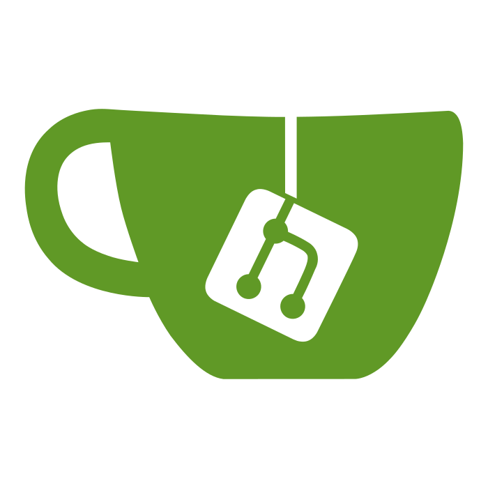 
<b>Gitea</b> 
2026-08-06
</td>
<td align="center" width="25%">
 
<b>Apache Guacamole</b> 
2026-08-06
</td>
<td align="center" width="25%">
 
<b>Hermes Agent</b> 
2026-08-06
</td>
</tr>
<tr>
<td align="center" width="25%">
 
<b>Home Assistant</b> 
2026-08-06
</td>
<td align="center" width="25%">
 
<b>n8n</b> 
2026-08-06
</td>
<td align="center" width="25%">
 
<b>Ollama</b> 
2026-08-06
</td>
<td align="center" width="25%">
 
<b>Open WebUI</b> 
2026-08-06
</td>
</tr>
<tr>
<td align="center" width="25%">
 
<b>OpenGist</b> 
2026-08-06
</td>
<td align="center" width="25%">
 
<b>Paperless-AI</b> 
2026-08-06
</td>
<td align="center" width="25%">
 
<b>Paperless-ngx</b> 
2026-08-06
</td>
<td align="center" width="25%">
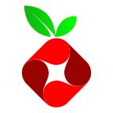 
<b>Pi-hole</b> 
2026-08-06
</td>
</tr>
<tr>
<td align="center" width="25%">
 
<b>Portainer</b> 
2026-08-06
</td>
<td align="center" width="25%">
 
<b>Runtipi</b> 
2026-08-06
</td>
<td align="center" width="25%">
 
<b>Syncthing</b> 
2026-08-06
</td>
<td align="center" width="25%">
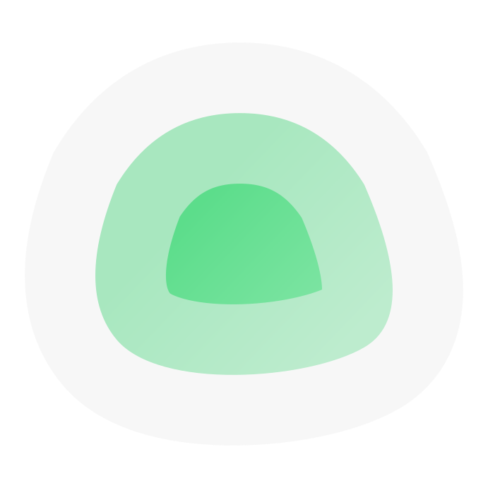 
<b>Uptime Kuma</b> 
2026-08-06
</td>
</tr>
<tr>
<td align="center" width="25%">
 
<b>Vaultwarden</b> 
2026-08-06
</td>
<td align="center" width="25%">
 
<b>What's Up Docker</b> 
2026-08-06
</td>
<td></td>
<td></td>
</tr>
</table>
