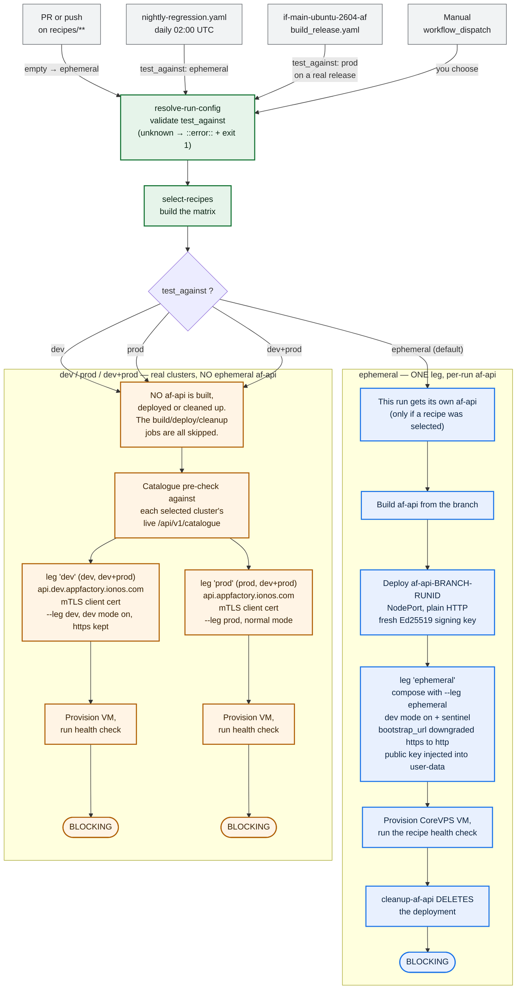

# af-recipes

Application Factory recipes — declarative application definitions consumed by the AF API.

## Recipe Format

Each recipe lives in `recipes/<app-name>/` and contains:

| File | docker-compose | native | Description |
|---|---|---|---|
| `metadata.yaml` | required | required | App info, parameters, resource requirements |
| `docker-compose.yaml` | required | — | Compose v3 service definition |
| `.env.template` | required | — | Shipped verbatim to the VM's `.env` — no placeholder substitution (IF-944/IF-1417) |
| `install.sh` | required | required | Prep only for docker-compose (compose-up.sh starts the stack); full install for native — see [rfc/001-recipe-schema.md §9](rfc/001-recipe-schema.md#9-installsh) |
| `health-check.sh` | required | required | CI-only health check script |
| `logo.svg` | required* | required* | App logo shown in catalogue thumbnails (*required when `enabled: true`) |

See [rfc/001-recipe-schema.md](rfc/001-recipe-schema.md) for the full specification.

### Logos

Every customer-visible (`enabled: true`) recipe ships an SVG logo at
`recipes/<id>/logo.svg`, referenced from `metadata.yaml` via `logo_url`,
`logo_sha256`, `logo_license`, and `logo_source`. Git is the source of truth; the
[`recipe-pipeline.yaml`](.github/workflows/recipe-pipeline.yaml) workflow mirrors
changed logos to IONOS Object Storage (the `appfactory-dev` bucket on PRs, the
`appfactory` production bucket on merge) and serves them over HTTPS on a
`recipe_version`-versioned, immutably-cached path. See
[CONTRIBUTING.md](CONTRIBUTING.md#adding-a-logo) for the how-to and
[docs/buckets.md](docs/buckets.md) for the storage/operations reference.

## Quick Reference

| App | Category | Web UI | Other Ports | Min RAM | Notes |
|-----|----------|--------|-------------|---------|-------|
| [AdGuard Home](recipes/adguard-home/) | security | `:3000` (setup), `:80` | `:53` DNS tcp+udp | 256 MB | ⚠️ incompatible with Pi-hole |
| [Apache Guacamole](recipes/guacamole/) | infrastructure | `:8080` | — | 1 GB | ⚠️ port conflict with Pi-hole |
| [Claude Code](recipes/claude-code/) | developer-tools, ai | — (native) | — | 2 GB | |
| [Gemini CLI](recipes/gemini-cli/) | developer-tools, ai | — (native) | — | 1 GB | |
| [Gitea](recipes/gitea/) | developer-tools | `:3000` | `:2222` SSH | 512 MB | ⚠️ port conflict with WUD, AdGuard |
| [Home Assistant](recipes/home-assistant/) | automation | `:8123` | — | 1 GB | bridge mode; no BT/USB |
| [Immich](recipes/immich/) | media | `:2283` | — | 4 GB | |
| [n8n](recipes/n8n/) | automation | `:5678` | — | 2 GB | |
| [Ollama](recipes/ollama/) | ai | `:11434` | — | 8 GB | GPU recommended |
| [OpenClaw](recipes/openclaw/) | ai, automation | `:18789` | — | 2 GB | |
| [OpenGist](recipes/opengist/) | developer-tools | `:6157` | `:2222` SSH | 256 MB | ⚠️ SSH port conflict with Gitea |
| [Paperless-ngx](recipes/paperless-ngx/) | productivity | `:8000` | — | 2 GB | |
| [Pi-hole](recipes/pihole/) | security | `:8080` | `:53` DNS tcp+udp | 256 MB | ⚠️ incompatible with AdGuard Home |
| [Portainer](recipes/portainer/) | infrastructure | `:9443` HTTPS | `:8000` Edge | 512 MB | |
| [Syncthing](recipes/syncthing/) | productivity | `:8384` | `:22000` tcp+udp | 256 MB | |
| [Uptime Kuma](recipes/uptime-kuma/) | monitoring | `:3001` | — | 256 MB | |
| [Vaultwarden](recipes/vaultwarden/) | security | `:80` | — | 256 MB | ⚠️ port conflict with AdGuard (post-setup) |
| [What's Up Docker](recipes/wud/) | monitoring | `:3000` | — | 256 MB | **not installed** — auto-injection off since IF-1465; ⚠️ port conflict with Gitea, AdGuard |
| [AnyType Server](recipes/anytype-server/) | productivity | `:4830` coordinator | `:4730`, `:4630`, `:9000` | 2 GB | 5-service stack (+ MongoDB, MinIO) |
| [Paperless-AI](recipes/paperless-ai/) | productivity, ai | `:3000` | — | 512 MB | companion for Paperless-ngx; needs API token |
| [Runtipi](recipes/runtipi/) | infrastructure | `:80`, `:443` | — | 1 GB | manages own Docker apps; socket mount |
| [WireGuard Easy](recipes/wg-easy/) | security | `:51821` | `:51820/udp` VPN | 256 MB | requires NET_ADMIN cap |

> **Port conflicts** arise only when multiple apps are co-installed on the same server.
> Use `incompatible_with_apps` in `metadata.yaml` to prevent conflicting pairs from being selected together.

## Available Recipes

<table>
<tr>
<td align="center" width="33%">
<a href="recipes/n8n/">

</a>
<br />
<sub><b>Workflow Automation</b></sub>
<br />
<sub>


</sub>
<br />
<sub>Connect apps and APIs with a low-code visual editor</sub>
</td>
<td align="center" width="33%">
<a href="recipes/portainer/">

</a>
<br />
<sub><b>Container Management</b></sub>
<br />
<sub>


</sub>
<br />
<sub>GUI for managing Docker environments</sub>
</td>
<td align="center" width="33%">
<a href="recipes/ollama/">

</a>
<br />
<sub><b>Local LLM Runner</b></sub>
<br />
<sub>


</sub>
<br />
<sub>Run large language models locally &mdash; GPU recommended</sub>
</td>
</tr>
<tr>
<td align="center" width="33%">
<a href="recipes/openclaw/">

</a>
<br />
<sub><b>AI Agent Runtime</b></sub>
<br />
<sub>


</sub>
<br />
<sub>Personal AI assistant via Telegram, Discord, Slack &amp; more</sub>
</td>
<td align="center" width="33%">
<a href="recipes/claude-code/">

</a>
<br />
<sub><b>AI Coding Assistant</b></sub>
<br />
<sub>


</sub>
<br />
<sub>Agentic AI tool for terminal-based coding</sub>
</td>
<td align="center" width="33%">
<a href="recipes/gemini-cli/">

</a>
<br />
<sub><b>AI Coding Assistant</b></sub>
<br />
<sub>


</sub>
<br />
<sub>Interact with Google Gemini models from the terminal</sub>
</td>
</tr>
<tr>
<td align="center" width="33%">
<a href="recipes/gitea/">

</a>
<br />
<sub><b>Git Server</b></sub>
<br />
<sub>


</sub>
<br />
<sub>Lightweight self-hosted Git service with web interface</sub>
</td>
<td align="center" width="33%">
<a href="recipes/opengist/">

</a>
<br />
<sub><b>Gist Service</b></sub>
<br />
<sub>


</sub>
<br />
<sub>Self-hosted pastebin and Gist service powered by Git</sub>
</td>
<td align="center" width="33%">
<a href="recipes/immich/">

</a>
<br />
<sub><b>Photo Management</b></sub>
<br />
<sub>


</sub>
<br />
<sub>High-performance self-hosted photo and video backup</sub>
</td>
</tr>
<tr>
<td align="center" width="33%">
<a href="recipes/paperless-ngx/">

</a>
<br />
<sub><b>Document Management</b></sub>
<br />
<sub>


</sub>
<br />
<sub>Searchable archive for physical documents</sub>
</td>
<td align="center" width="33%">
<a href="recipes/vaultwarden/">

</a>
<br />
<sub><b>Password Manager</b></sub>
<br />
<sub>


</sub>
<br />
<sub>Lightweight Bitwarden-compatible password manager</sub>
</td>
<td align="center" width="33%">
<a href="recipes/wg-easy/">

</a>
<br />
<sub><b>VPN Server</b></sub>
<br />
<sub>


</sub>
<br />
<sub>WireGuard VPN with a simple web UI</sub>
</td>
</tr>
<tr>
<td align="center" width="33%">
<a href="recipes/adguard-home/">

</a>
<br />
<sub><b>DNS Ad-Blocker</b></sub>
<br />
<sub>


</sub>
<br />
<sub>Network-wide DNS filtering and privacy protection</sub>
</td>
<td align="center" width="33%">
<a href="recipes/pihole/">

</a>
<br />
<sub><b>DNS Ad-Blocker</b></sub>
<br />
<sub>


</sub>
<br />
<sub>Network-wide DNS sinkhole for ad blocking</sub>
</td>
<td align="center" width="33%">
<a href="recipes/syncthing/">

</a>
<br />
<sub><b>File Sync</b></sub>
<br />
<sub>


</sub>
<br />
<sub>Continuous P2P file synchronization between devices</sub>
</td>
</tr>
<tr>
<td align="center" width="33%">
<a href="recipes/uptime-kuma/">

</a>
<br />
<sub><b>Monitoring</b></sub>
<br />
<sub>


</sub>
<br />
<sub>Self-hosted uptime and service monitoring</sub>
</td>
<td align="center" width="33%">
<a href="recipes/wud/">

</a>
<br />
<sub><b>Update Monitor</b></sub>
<br />
<sub>


</sub>
<br />
<sub>Get notified when new container image versions are available</sub>
</td>
<td align="center" width="33%">
<a href="recipes/guacamole/">

</a>
<br />
<sub><b>Remote Desktop Gateway</b></sub>
<br />
<sub>


</sub>
<br />
<sub>Clientless RDP, VNC and SSH via browser</sub>
</td>
</tr>
<tr>
<td align="center" width="33%">
<a href="recipes/home-assistant/">

</a>
<br />
<sub><b>Home Automation</b></sub>
<br />
<sub>


</sub>
<br />
<sub>Open source home automation with local control</sub>
</td>
<td align="center" width="33%">
<a href="recipes/paperless-ai/">

</a>
<br />
<sub><b>AI Document Analysis</b></sub>
<br />
<sub>


</sub>
<br />
<sub>AI-powered auto-tagging companion for Paperless-ngx</sub>
</td>
<td align="center" width="33%">
<a href="recipes/runtipi/">

</a>
<br />
<sub><b>App Store</b></sub>
<br />
<sub>


</sub>
<br />
<sub>Self-hosted app store for easy application deployment</sub>
</td>
</tr>
<tr>
<td align="center" width="33%">
<a href="recipes/anytype-server/">

</a>
<br />
<sub><b>Knowledge Management</b></sub>
<br />
<sub>


</sub>
<br />
<sub>Self-hosted sync server for AnyType notes &amp; knowledge base</sub>
</td>
<td align="center" width="33%">
</td>
<td align="center" width="33%">
</td>
</tr>
</table>

## Build Catalogue

Generate `catalogue.json` from all `metadata.yaml` files:

```bash
python3 bin/build-catalogue
```

Requires `pyyaml` (`pip install pyyaml`).

## Contributing

1. Create a new directory under `recipes/` matching your app's `name` field.
2. Add all required files for your recipe type.
3. Run `python3 bin/build-catalogue` to validate.
4. Submit a PR for review.

See [CONTRIBUTING.md](CONTRIBUTING.md) for the full guide, including how to add a
recipe logo and the logo licensing rules.

## Testing

The CI workflows, and — most importantly — **how to test a branch or a specific
version**. For the OS image these recipes install onto, see
[`if-main-ubuntu-2604-af`](https://github.com/IONOS-Server-Technology/if-main-ubuntu-2604-af#ci-pipeline-build_releaseyaml).

### The workflows

| Workflow | Trigger | Where it runs | Cost / time |
|----------|---------|---------------|-------------|
| [`recipe-pipeline.yaml`](.github/workflows/recipe-pipeline.yaml) | PR / push to `main` on `recipes/**` or `bin/build-catalogue` | GitHub runner (static + S3 logo sync) | seconds–1 min |
| [`test-recipes-docker.yaml`](.github/workflows/test-recipes-docker.yaml) | PR to `main` on `recipes/**`, manual | `docker compose` on the runner, one app at a time | ~2–5 min |
| [`test-recipes-live.yaml`](.github/workflows/test-recipes-live.yaml) | PR to `main` on `recipes/**`, push on `feature/IF-547-**`, manual, `workflow_call` | **Depends on `test_against`** — `ephemeral`: CoreVPS VM + a per-run throwaway `af-api` in k8s (no real cluster); `dev` / `prod` / `dev+prod`: CoreVPS VMs against the **real dev and/or prod clusters**, no ephemeral `af-api` | ~10–15 min (`ephemeral` or one cluster), roughly 2× that for `dev+prod`, IONOS quota |
| [`nightly-regression.yaml`](.github/workflows/nightly-regression.yaml) | Daily `0 2 * * *` UTC, manual | Reuses `test-recipes-live` via `workflow_call` with **`test_against: ephemeral`** (all enabled recipes) | ~30–60 min |
| [`test-recipes-combinations.yaml`](.github/workflows/test-recipes-combinations.yaml) | Daily `0 3 * * *` UTC, manual | Reuses `test-recipes-live` via `workflow_call` with **`test_against: ephemeral`**, with a multi-app combination matrix and a `base_domain` | ~30–60 min |
| [`debug-af-api.yaml`](.github/workflows/debug-af-api.yaml) | Manual | Deploys `af-api` and holds it for `kubectl` | as long as you hold it |
| [`af-api-cleanup.yaml`](.github/workflows/af-api-cleanup.yaml) | Manual | Reaps orphaned ephemeral `af-api` deployments | seconds |

- **`recipe-pipeline.yaml`** — the static gate plus (mutating) logo mirroring:
  `sync-logos` uploads changed `recipes/<id>/logo.svg` to IONOS Object Storage
  (`appfactory-dev` on a PR, **prod + dev** on merge to `main`; **fails a logo
  change that doesn't bump `recipe_version`**); `validate` runs `bin/build-catalogue`
  and checks required files / compose structure / `.env.template` placeholders;
  `af-validate-rfc002` runs the [RFC-002](rfc/002-recipe-rules.md) rules and HEADs
  every `logo_url`. (This replaced the old `validate-recipes.yaml`.)
- **`test-recipes-docker.yaml`** (Phase 1) — spins up each selected app's
  `docker-compose.yaml` on the runner, runs `health-check.sh` against `localhost`, and
  tears it down again before starting the next one. Each app gets its own compose
  project, and only one runs at a time, so apps that publish the same host port do not
  collide. Matrix = changed compose recipes (native recipes dropped here), or one entry
  per combination when the combination inputs are used. This leg proves each member of
  a selection *starts*; the live leg proves they *coexist* on one VM.
- **`test-recipes-live.yaml`** (Phase 2) — the end-to-end VM test: renders cloud-init
  via `/compose`, provisions a **real CoreVPS VM**, and runs the recipe's health check
  on it. Matrix = changed recipes with `enabled: true`. **What it runs against depends
  on the `test_against` input** — see [Test targets](#test-targets-ephemeral-af-api-vs-the-real-clusters).
  The shape below is `test_against: ephemeral`; for `dev` / `prod` / `dev+prod` the
  `af-api` build, deploy and cleanup jobs are all skipped.

  ```
  resolve-run-config  →  select-recipes  →  trigger-af-api-build  →  deploy-af-api
        →  test-recipes (matrix)                                  →  cleanup-af-api (always)
             ├─ discover "_af" image UUID (or use the image_uuid input)
             ├─ /compose → cloud-init → patch dev-mode/http
             ├─ probe /bootstrap with the JWT
             └─ ImageTester: provision VM, inject cloud-init, run
                generated per-app config (SSH probes + uploaded health-check.sh, all on the VM)
  ```
- **`nightly-regression.yaml`** — a dedicated scheduled workflow that reuses
  `test-recipes-live.yaml` via `workflow_call` (`with: all_enabled: true`) over every
  enabled recipe — same run, no second runner, no separate renderer. It passes
  **`test_against: ephemeral`**: the throwaway `af-api` path, never the real
  clusters. Scheduled runs fire only from the default branch; use `workflow_dispatch`
  to run it by hand.
- **`test-recipes-combinations.yaml`** — nightly multi-app coverage. Every other
  pipeline installs exactly one app per VM, so nothing exercises apps sharing a VM, or
  the Traefik render a multi-app selection forces. Like the nightly regression it
  re-implements nothing: it calls `test-recipes-live.yaml` via `workflow_call` with a
  combination matrix and a `base_domain`. Deliberately **not** on the PR trigger and
  deliberately `test_against: ephemeral` — a randomly drawn combination must not be able
  to fail an unrelated merge, and a real-cluster run would double the VM cost per
  combination while letting a random draw block a production image build.
- **`debug-af-api.yaml`** — deploys an `af-api` for a chosen `af_recipes_ref` and
  holds it `hold_minutes` (default 30) so you can attach with your own `kubectl`
  (`exec`, `logs`). `skip_build=true` reuses the image already in Harbor.
- **`af-api-cleanup.yaml`** — reaps ephemeral `af-api` deployments a force-cancelled
  run left behind (`max_age_hours`, default 6.5).

### Test targets: ephemeral `af-api` vs the real clusters

`test-recipes-live.yaml` runs against one of four targets, chosen by the `test_against`
input. With **`test_against: ephemeral`** (the default) the run builds its own throwaway
`af-api`, tests against it, and deletes it — it touches no real cluster. With **`dev`**,
**`prod`** or **`dev+prod`** it builds no `af-api` at all and tests against the named
real cluster(s). That is why an ephemeral `af-api` is sometimes there and sometimes not.

The input value names its target directly, and each matrix leg is named after the
cluster it hits (`ephemeral`, `dev`, `prod`) — there is no longer any overloaded "dev".

`test_against` defaults to `ephemeral` (an empty input on the push/PR triggers resolves
to it), and it is validated. The first job, `resolve-run-config`, runs
`scripts/resolve-test-target.py`, which accepts only `ephemeral`, `dev`, `prod` and
`dev+prod`; any other value is rejected with a `::error::` annotation and exit 1. There
is **no silent fallback** — an unknown value fails the run fast.



|                          | `ephemeral` (default)                          | `dev` / `prod` / `dev+prod`                    |
|--------------------------|------------------------------------------------|------------------------------------------------|
| Matrix legs              | one, named `ephemeral`                          | one per selected cluster, named `dev` / `prod`  |
| Ephemeral `af-api`       | built (if a recipe was selected), deployed, cleaned up | **none** — build/deploy/cleanup jobs all skipped |
| `af-api` it talks to     | `af-api-<branch>-<run_id>` on a k8s NodePort    | the real cluster deployments                    |
| Transport / client auth  | plain HTTP, no client cert                      | HTTPS with an mTLS client cert on every leg     |
| Bootstrap signing key    | fresh Ed25519 per run, public half in user-data | the real keys baked into the image              |
| cloud-init patch         | `--leg ephemeral`                               | `--leg dev` / `--leg prod`                      |
| Catalogue pre-check      | skipped (branch build, in sync by construction) | runs against each selected cluster's catalogue  |
| Gates the build          | yes                                             | yes — every selected leg blocks                 |

Who sets which target:

| Trigger | `test_against` |
|---------|----------------|
| PR or push on `recipes/**` | `ephemeral` — an empty input resolves to it |
| `nightly-regression.yaml` | `ephemeral` |
| `test-recipes-combinations.yaml` | `ephemeral` |
| `if-main-ubuntu-2604-af` → `build_release.yaml` | **`prod`** on a real release (branch `main`, `dev_mode_image != 'true'`); otherwise `ephemeral` |
| Manual `workflow_dispatch` | your choice (`ephemeral` / `dev` / `prod` / `dev+prod`), default `ephemeral` |

> **Every selected leg blocks.** If you ask to test a cluster, a failure on that
> cluster's leg fails the run — the dev leg is no longer advisory / non-blocking. The
> automated release build therefore tests **prod only** (`test_against: prod`), so a
> flaky dev cluster cannot block a release; the real **dev** cluster is exercised only
> by a deliberate `test_against: dev` or `dev+prod` dispatch.

> **The ephemeral `af-api` is built only when it is needed.** It is built and deployed
> only when `test_against == ephemeral` **and** at least one recipe or combination was
> selected. A run that selects nothing (e.g. a PR touching only disabled recipes) builds
> no throwaway `af-api`.

> **Ordering rule — deploy the prod `af-api` before activating a recipe.** A real-cluster
> leg is derived from the **live** catalogue, and `af-api` bakes an `af-recipes`
> snapshot at image build time. Merge an activation first and the blocking prod leg
> fails with `recipe_not_found`, stopping **every** production image build. Deploy an
> `af-api` carrying the recipe to prod first, then merge the activation.

> **Nothing in the UI tells you which target ran.** `Test target: <value> (clusters: …)`
> goes to the `select-recipes` job log only, never the step summary. A **skipped**
> `Deploy af-api for branch` means a real-cluster run (`dev` / `prod` / `dev+prod`), not
> a failure and not a leak.
> (`test-recipes-docker.yaml`'s `| Mode | docker-on-runner (Phase 1) |` summary row is
> unrelated — that workflow has no `test_against` input.)

The long-form version, including the catalogue pre-check's failure modes, is on
Confluence:
[AF Recipe Testing — Pipeline Modes](https://confluence.united-internet.org/pages/viewpage.action?pageId=780057911).

### Multi-app combinations

By default both test legs install **one app per job**. The combination inputs switch
them to drawing multi-app selections instead, which is what a customer picking several
apps for one VM actually gets. `scripts/select-combinations.py` does the drawing, from
`catalogue.json`.

`test-recipes-live.yaml`:

| Input | Meaning |
|-------|---------|
| `combos` | Combination matrix as JSON, e.g. `[{"apps":"immich n8n","label":"immich+n8n","size":2}]`. Skips selection entirely. |
| `sizes` | Sizes to draw, e.g. `1,2,3`. **One combination is drawn per requested size** — `sizes: 1` is a single randomly drawn app, not "each recipe on its own". |
| `fixed_combos` | Combinations to use verbatim, e.g. `"immich+n8n,vaultwarden"`. |
| `seed` | Seed for the draw. The effective seed is logged either way, so any run can be replayed. |
| `base_domain` | `base_domain` passed to `/compose`. Empty = fall back to the sslip.io name derived from the reserved test IP (IF-1386), so Traefik always renders and host ports are not published; pass `af-test.invalid` (what combination runs use) if you want a domain that can never obtain a certificate. `af-api` **requires** one for any multi-app combination. |
| `template_id` | IONOS VM template UUID for the test VMs (default `vars.IONOS_TEMPLATE_ID`). |

`test-recipes-docker.yaml` takes `sizes`, `fixed_combos` and `seed` with the same
meanings; setting any of them switches it to combination mode.

Because a multi-app VM has more than one app to assert against,
[`scripts/gen-health-check-conf.py`](scripts/gen-health-check-conf.py) emits the
per-app blocks itself, once per member of the selection — otherwise every app but
one would go unchecked. There is no committed config it expands: the generator is
the definition of the suite, and the workflow writes its output to
`tests/recipe-health-check.combo.conf` per combination.

### Running and verifying the generator locally

The generator is a plain script — run it yourself to see what the workflow will assert.
Inspecting the output for a selection just needs the recipe ids:

```bash
python3 scripts/gen-health-check-conf.py immich n8n
```

That prints the assembled config to stdout. To reproduce exactly what a live combination leg
generates, pass the same flags the workflow does:

```bash
python3 scripts/gen-health-check-conf.py immich n8n \
  --base-domain af-test.invalid --recipe-label immich+n8n --expect-le-staging
```

To confirm the output matches what you expect, diff it against a conf file **you** provide. That
target file is yours and is **not** committed — this is not a golden fixture, just a scratch copy
of the config you expect. Two routes:

(a) `--check` does the diff for you and sets the exit code — a unified diff and exit 1 on any
drift, or a `check: generated config matches …` message and exit 0 if identical. It is mutually
exclusive with `--output`:

```bash
python3 scripts/gen-health-check-conf.py immich n8n \
  --base-domain af-test.invalid --recipe-label immich+n8n --expect-le-staging \
  --check my-expected.conf
```

(b) no-code fallback — capture stdout and use `diff -u`:

```bash
python3 scripts/gen-health-check-conf.py immich n8n > /tmp/out.conf && diff -u my-expected.conf /tmp/out.conf
```

Both routes need PyYAML importable in the environment (the script reads the manifest as YAML).

You do not have to supply a target to be protected from an empty suite: **every** generation
already runs the built-in `assert_config_populated` base check, which fails loudly if the config
would declare fewer `[section]` headers than the manifest's unconditional floor, or would drop a
per-app section for a requested app. A silently-empty "green run that tested nothing" cannot be
emitted.

Per-app checks can be overridden per recipe via `recipes/<id>/test-checks.yaml` (fully replaces,
does not merge, that recipe's per-app list). For authoring checks — templates, gates, and the
override mechanism — see [docs/health-check-spec.md](docs/health-check-spec.md) and the header of
`tests/checks/manifest.yaml`; adding a check that needs a new gate also means editing the
generator's `resolve_gates` / `resolve_app_gates`.

### Committed golden snapshots

The scratch `--check` above protects a config **you** describe. To guard the generator
itself against silent drift, a small matrix of committed snapshots lives under
[`tests/golden/`](tests/golden/). [`tests/golden/cases.yaml`](tests/golden/cases.yaml) is
the single source of truth listing each case (its recipes, base domain, recipe label and
LE-staging flag) and the `.conf` golden it maps to. The matrix deliberately locks the
routable (served-certificate present), non-routable (served-certificate absent) and
two-app combination paths.

CI runs [`scripts/golden-health-checks.py`](scripts/golden-health-checks.py) — the same
helper you run locally — which regenerates each case and diffs it against its committed
golden, failing with an actionable `::error::` on any difference:

```bash
python3 scripts/golden-health-checks.py            # CHECK: diff each golden, non-zero on drift
```

If you intentionally change the generator's output, regenerate every golden and commit the
result:

```bash
python3 scripts/golden-health-checks.py --update   # rewrite every committed golden
```

### How to test a branch or a specific version

1. **Recipe change (single-repo):** open a PR touching `recipes/**`. That runs, in
   parallel, `recipe-pipeline.yaml` (validation), `test-recipes-docker.yaml` (fast),
   and `test-recipes-live.yaml` with `test_against: ephemeral` (full VM install of every *enabled*
   changed recipe). No cross-repo setup — the `af-api` lookup falls back to `main`.
2. **Recipe change that needs `af-api` too:** give that repo a branch with the
   **same name** (see [Same-name branch resolution](#same-name-branch-resolution)).
   The live test builds `af-api` from your branch and runs it.
3. **One recipe on demand (no PR):** dispatch `test-recipes-docker.yaml` (fast) or
   `test-recipes-live.yaml` (full VM) with `recipes=<name>` (comma-separated for
   several; empty ⇒ pilot set `n8n,portainer,ollama` for the docker workflow).
4. **Against a specific OS image version:** dispatch `test-recipes-live.yaml` with
   `image_uuid=<uuid>` (optionally plus `recipes=<name>`) to skip image discovery:

   ```bash
   ionosctl image list -o json \
     | jq -r '.items[] | select(.properties.name | test("_af.qcow2";"i"))
              | "\(.properties.createdDate) \(.id) \(.properties.name)"' \
     | sort | tail
   ```
5. **Validate a production image against the real clusters:** dispatch
   `test-recipes-live.yaml` with `test_against=prod` (or `dev+prod` to exercise the dev
   cluster too), normally together with `image_uuid=<uuid>` of a production image. No
   ephemeral `af-api` is built, and each selected cluster gets its own blocking leg. The
   `if-main-ubuntu-2604-af` `main` build runs `test_against: prod` automatically — the
   real dev cluster is exercised only by a deliberate `dev` / `dev+prod` dispatch. Do
   **not** use it to test an `af-recipes` branch — real-cluster legs read the live
   cluster catalogues, not your branch.
6. **Debug a broken `af-api`:** dispatch `debug-af-api.yaml`, then attach with
   `kubectl` using the deployment name it prints.

### OS-image integration

The OS image repo
[`if-main-ubuntu-2604-af`](https://github.com/IONOS-Server-Technology/if-main-ubuntu-2604-af)
calls **into** this repo: after building the image it publishes it to IONOS Cloud
and dispatches `test-recipes-live.yaml` here with that image's `image_uuid` (and the
resolved `af-recipes` ref), so *all enabled recipes* are installed on the brand-new
image, then deletes the throwaway image. A green OS-image build therefore proves the
image can bootstrap the whole catalogue.

### Same-name branch resolution

For `af-api`, the live workflow does:

```
branch = current af-recipes branch (head.ref on a PR, ref_name otherwise)
if branch exists on af-api → use it   else → fall back to main
```

`af-api` is built from its resolved ref (image tagged with the sanitised branch
name). `recipe-pipeline.yaml` and `test-recipes-docker.yaml` do the same lookup, but
instead of building an image they install `af-api` from that ref to get the
`af-validate` CLI.

> The validator used to be a separate `af-core` repo, resolved the same way. It is now
> af-api's in-tree `af_api.core` package (IF-1327), so there is one cross-repo lookup
> instead of two, and one ref rather than a pair that could disagree.

**Practical rule:** when a change spans repos, use the **same branch name**
everywhere (`af-recipes`, `af-api`, and the OS image). Single-repo PRs need no
setup — missing branches fall back to `main`.

### No test inputs to supply

Test scripts send only `{"id": "<slug>"}` per recipe. `/compose` accepts nothing else —
`ApplicationSelection` has a single field, because customer-supplied parameters went away
with IF-944. A recipe's own secrets are produced on the VM by its `install.sh`, or derived
from the server password by af-api via `generated_from`.

> Removed in IF-1454: recipes used to ship a `test-params.yaml` whose contents were sent
> alongside the id and then silently discarded by pydantic. The description here claimed the
> renderer would abort with `Missing required parameters: …` without one — that code has
> never existed in either repo, and the claim is what made the files look mandatory.

### Native recipes

Recipes without `docker-compose.yaml` (`recipe_type: native`, e.g. `claude-code`,
`gemini-cli`) install directly via `install.sh`. They are **excluded** from the
docker workflow by design, and included in the live/nightly workflows **only when
`enabled: true`**. The two native recipes are currently `enabled: false`, so they are
covered by `recipe-pipeline.yaml` (static) only — no end-to-end VM run yet.

### Pointers

- [docs/health-check-spec.md](docs/health-check-spec.md) — the `health-check.sh` contract.
- [docs/buckets.md](docs/buckets.md) — logo storage / Object Storage operations.
- [scripts/gen-health-check-conf.py](scripts/gen-health-check-conf.py) — **the** definition
  of the `python-dwh-testsuite` suite the live/nightly workflows run. It emits one config
  per combination (per-app blocks plus the VM-wide ones), written to the git-ignored
  `tests/recipe-health-check.combo.conf`; an assertion not emitted here runs nowhere.
  Run it locally to inspect the output, or pass `--check <target.conf>` to diff the generated
  config against a conf file you supply (unified diff, exit 1 on drift) — see
  [Running and verifying the generator locally](#running-and-verifying-the-generator-locally).
- `scripts/select-combinations.py` — draws the multi-app combination matrix from
  `catalogue.json` and prints it as JSON for `strategy.matrix.include`. `--compose-only`
  restricts it to recipes the docker leg can run.
- `scripts/call-compose.py`, `scripts/probe-bootstrap.py` — helpers for calling
  `/compose` and `/bootstrap`. Both take `--client-cert` / `--client-key`, which the
  real-cluster legs (`dev` / `prod`) use and the ephemeral leg omits.
- `scripts/patch-cloudinit-dev-mode.py` — adjusts the cloud-init returned by `/compose`
  for the leg it will boot on: `--leg ephemeral` (dev mode + sentinel, `https`→`http`),
  `--leg dev` (dev mode, `https` kept), `--leg prod` (normal mode, untouched).
